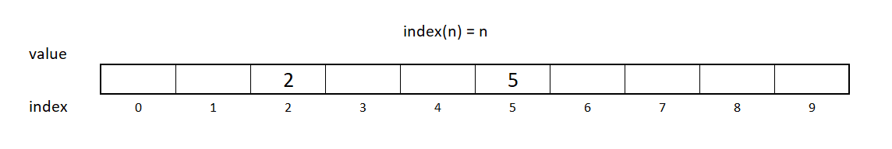
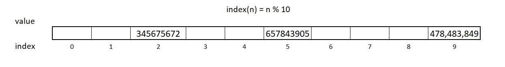

# Set
[Home Page](welcome.md)
## Introduction
Sets are another data structure that you can use. You may have used a stack, list, or a queue in the past and one thing that these data structures have in common is order. When it comes to a set, we will see some characteristics that make it unique.

## Characteristics
Sets don't need the data to be ordered and they also don't allow duplicates. One of the most important operations in a set is testing for membership. Sets are this way because of a technique called **hashing**. This technique allows you to remove, add, and test for membership or see if a value is in the set in O(1) time.

## Arrays and Hashing
If you wanted to find something in the array you could look it up with an index. If the index was also the value then you could add, remove, and check to see if your array has that value in O(1) time. Your function might look something like this: index(n) = n so if you added the value 2 then the index would also be 2 then you could also add 5 and the index would also be 5. This works because we have an array size 10.



This array is not full and has missing numbers. We call this a sparse array because the array is not guaranteed to be filled from left to right. This sparse array is what we call a set. You can also see in this example that this array couldn't allow duplicates. One value per index. What if we wanted to store a big number like 478,483,849 into our array? Then our array would need to be big enough to store that. Having such a big array could use a lot of memory so what if there was a way to store our value in our size 10 sparse array? We can and we can do it using modulo (%). So, using our formula from before of index(n) = n we can modulo 10 to have it look something like this index(n) = n % 10. So index(478,483,849) = 478,483,849 % 10 = 9 and we can store 478,483,849 in index 9 like this.



Another way to write our formula could be **index(n) = n % sparseArraySize** and this works great for numbers but if our value isn't a number we need to make it into a number. We can do this by using a **hashing function**. The formula would look like **index(data) = hash(data) % sparseArraySize**, where hash is a hashing function. The hashing function calculates an integer value based on the data. C# has a built in function called **GetHashCode()** that we can use. The values returned by this function are different each time the program is run but will be the same during the run.

Data Type | C# Code | Hash Code
--------- | --------- | ---------
positive int | 4.GetHashCode() | 4
negative int | -4.GetHashCode() | -4
string | "horse".GetHashCode() | -830875520
float/double | 1.17.GetHashCode() | -730355991
bool | false.GetHashCode() | 0
Stack/objects | new Stack<Stack<string>>().GetHashCode() | 32854180

Something to consider is if we only have 10 spots and we have 100 different values if we tried to place 567,347,269 this value also would be placed into index 9. This is called a conflict.

## Conflict
There are two ways to deal with conflict. First option is called **open addressing**. If you find that the index is already taken just move to the right until you find an open spot. This can result in more conflicts if those spaces are also full.
The second option is called **chaining** and instead of looking for a new place to put our data we make a list of values at the same index.
Both of these options can solve conflict but if not used correctly can make placing our value or searching through a list into O(n) time and not O(1).

## Sets in C#
In C# we call the set a HashSet. There are some operations that are used when using a HashSet and each operations performance is based on the hashing function.

Common Set Operation | Description | Performance
--------- | --------- | --------- 
add(value) | Use this to add a "value" to your set | O(1) - Performance of hashing the value (assuming good conflict resolution) 

```c#
HashSet<int> myHashSet = new HashSet<int>();
myHashSet.Add(1);
myHashSet.Add(2);
myHashSet.Add(3);
myHashSet.Add(4);
myHashSet.Add(5);   // These add 1 through 5 to the HashSet
                    // HashSet now contains 1,2,3,4,5
```

Common Set Operation | Description | Performance
--------- | --------- | ---------
remove(value) | This will remove the specified “value” from the set | O(1) - Performance of hashing the value (assuming good conflict resolution)

```c#
HashSet<int> myHashSet = new HashSet<int>() {1,2,3,4,5};

myHashSet.Remove(3); // We remove 3 and get 1,2,4,5
```

Common Set Operation | Description | Performance
--------- | --------- | ---------
member(value) | Will check to see if the specified “value” is in the set | O(1) - Performance of hashing the value (assuming good conflict resolution)

```c#
HashSet<int> myHashSet = new HashSet<int>() {1,2,3,4,5};

bool value1 = myHashSet.Contains(3);  // Contains returns a bool so value1 = true
bool value2 = myHashSet.Contains(6); // value2 = false
```

Common Set Operation | Description | Performance
--------- | --------- | --------- 
size() | Returns the total amount of items in the set | O(1) - Performance of hashing the value (assuming good conflict resolution)

```c#  
HashSet<int> myHashSet = new HashSet<int>() {1,2,3,4,5};

int size = myHashSet.Count(); // size is 5
```

There are also two mathematical operations you can use with set (intersection, and union) that are available from methods in the class:

```c#
HashSet<string> firstSet = new HashSet<string>(){"Hello", "World"};
HashSet<string> secondSet = new HashSet<string>(){"Wonderful", "World"};
HashSet<string> set3 = firstSet.Intersect(secondSet).ToHashSet(); // This will result in {World}
HashSet<string> set4 = firstSet.Union(secondSet).ToHashSet();     // This will result in {Hello, World, Wonderful}
```

## Example
Registering for classes you don't want to take the same class you are already taking or have taken already. You can use a set to help keep track of classes that you plan on taking.

First, we can add some classes that the student is taking to our HashSet.

```c#
HashSet<string> myClasses = new HashSet<string>();
myClasses.Add("CSE 121B");
myClasses.Add("CSE 121A");
myClasses.Add("CSE 121E");
myClasses.Add("DS 150");
myClasses.Add("CSE 212");
myClasses.Add("CSE 180");

//CSE 121B, CSE 121A, CSE 121E, DS 150, CSE 212, CSE 180
// are now in the set
```

Now we have some classes in our set. If the student tries to add a class already on the list, then it won't add.

```c#
myClasses.Add("CSE 180");
// we still get CSE 121B, CSE 121A, CSE 121E, DS 150, CSE 212, CSE 180
// we won't add that second CSE 180
```

If a student wants to remove a class because they are dropping it or some other reason we can do that as well with **remove()**. 
Say we remove CSE 212 we could do that like this.

```c#
// Now we go from this
// CSE 121B, CSE 121A, CSE 121E, DS 150, CSE 212, CSE 180

myClasses.Remove("CSE 212");
// To this:
// CSE 121B, CSE 121A, CSE 121E, DS 150, CSE 180
```

We can also check to see if a class is in the set with **Contains()** to see if they have already registered for it.

```c#
myClasses.Contains("DS 150");   // returns True.
myClasses.Contains("CSE 212");  // returns False.
```

We can also see how many items or classes we have registered for in our set with **Count**.

```c#
// since our HashSet myClasses looks like:
// CSE 121B, CSE 121A, CSE 121E, DS 150, CSE 212, CSE 180

Console.WriteLine(myClasses.Count); //this returns 6.
```

## Problem
When you need to reset your password, you can't set your new password to an old password. You can use a set to help keep track of old passwords for an account. 

[Solution](solutions/set_solution/Program.cs)

[Home Page](welcome.md) | [Top](#set)

