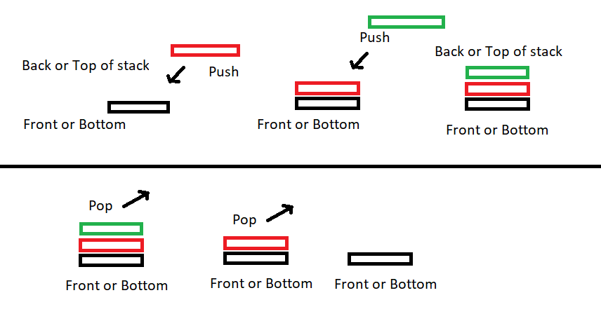

# Stack
[Home Page](welcome.md)
## Intro
When you think of a **stack** as a data structure type, think of it like anything else you can stack in the real world. A stack of cards, plates, cloths, whatever you can stack is basically how a stack works in programing. A key characteristic to remember is the order in with items are added and removed. A popular saying would be “Last In, First Out” (LIFO) or the last item you add is the first one you take.

## Using a Stack
A stack is good at keeping track of what you put on it and the order in which it was placed. When you add or **push** an item onto the stack it goes to the back. You can add more on top until you’re ready to take something off or **pop** it from the back of the stack. You push and pop from the back so the first item you added might be there a while until you make your way to the front again. You can't insert anywhere into a stack only add to the back so a strength would be it keeps track of how items are added. 

## Efficiency of common operations
Some built in functions that you can use with stack and some examples of how you use them are listed below.
Stack Operations | Description | Performance
-------- | -------- | --------
push(value) | Use this to add "value" to the back or top of the stack. Below in the example "value" is a string. We can add strings to our stack of strings.  | O(1)
```c#
// Makes a new stack of strings
Stack<string> myStack = new Stack<string> ();
// Add "Hello" to the stack
myStack.Push("Hello");
```
Stack Operations | Description | Performance
-------- | -------- | --------
pop() | Removes and returns the item from the back\top of the Stack. |  O(1)
```c#
// Makes a new stack of int's
Stack<int> myStack = new Stack<int> ();
// Add some values
myStack.Push(1);
myStack.Push(2);
myStack.Push(3);
// stack is now 1,2,3
myStack.Pop();
//stack is now 1,2 
Console.WriteLine(myStack.Pop()); // this should return 2 
```
Stack Operations | Description | Performance
-------- | -------- | --------
size() | Returns the total count of elements in the Stack. | O(1)
```c#
// Makes a new stack of an array of integers
Stack<int> myStack = new Stack<int> (new[] {0,1,2,3,4});

var size = myStack.Count;// store the count in int size.
Console.WriteLine(size); // 5
```
Stack Operations | Description | Performance
-------- | -------- | --------
empty() | Returns true if the size of the stack is zero. | O(1)
```c#
bool empty;

if (emptyStack.Count == 0)
{
    empty = true;
}
else
    empty = false;
```

## Example
When you play a card game that deck of cards is a Stack. Taking a card would pop from the top and then placing it back on the deck would be pushing it to the top.



Say you have a deck of 9 cards in a Stack. Notice it gives you the information in reverse of how it is entered. Last in, first out.
```c#
Stack<int> deck = new Stack<int>(new List<int>() {9,8,7,6,5,4,3,2,1});

// You can print out what is in your Stack like this: 

Console.Write(string.Join(",", deck)); // this gives you 1,2,3,4,5,6,7,8,9
```
Now if you want to draw a card from your deck you can use the **Pop()** function.
```c#
deck.Pop(); // this gives you 1

// Stack is 2,3,4,5,6,7,8,9
```
Pop returns so you can store that value in a variable for use later.
```c#
int card = deck.Pop(); // now "card" is storing the value
```
If you put your card back onto the stack you can use the **Push()** function.
```c#
deck.Push(1); // Stack is 1,2,3,4,5,6,7,8,9 again.
```
To make sure that all 9 are in there you can use **Count**
```c#
int size = deck.Count; // Count returns an int of how many items are in the stack.
Console.Write(size); // 9
```
## Problem to Solve

Your roommates decide to go hiking on a trail none of them have ever hiked before. There is a chance you could get lost, so you decide to take notes of each landmark you pass. Use a Stack to help you find your way in and out of this hiking trail.

Landmarks Passed:
* Bent Tree
* Petrified Stumps
* Flowery Meadow
* Waterfall
* Bolder Field 

 [Solution](solutions/stack_solution/Program.cs)

[Home Page](welcome.md) | [Top](#stack)

<!-- First: walk them though an example using code. list of most used cereal with the last used cereal showing up first in the list problem: keeping track of most recent cereal-->