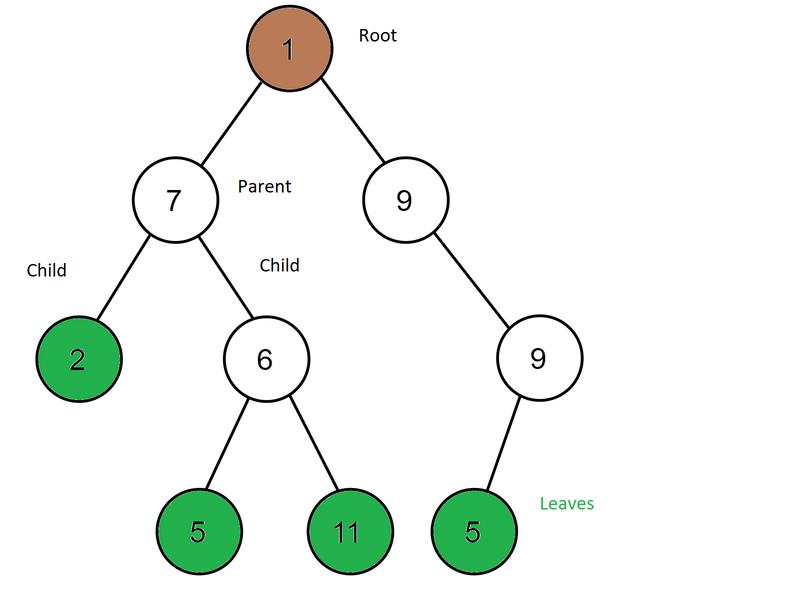
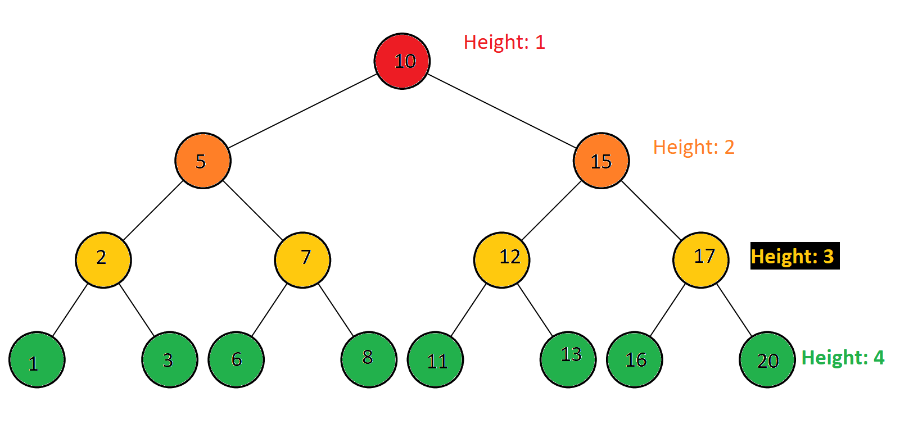

# Tree
[Home Page](welcome.md)
## Introduction
Trees contain nodes that are connected with pointers. A tree can connect to many different nodes. 

## Binary Tree
When we talk about trees, we can mean different types so a good starting place is a **Binary Tree**.
This type of tree is set up so a parent node only links to two other nodes. The top node is called the root and nodes that don't connect to other nodes are called leaf nodes. If a node is connected to another node then it’s called a parent node. Nodes connected to the parent are called child nodes. Nodes to the left and right of the parent node form a subtree. You can only have one root node.



## Binary Search Tree
A binary Search tree is just a Binary tree with some rules on how the data is placed into the tree. When you add values into the tree you compare that data to the parent node. A comparison example could be if the data is less than the parent node then you add it to the left subtree. If that data is more than the parent, then you add it to the right subtree. When you do this, the data you add is sorted. This sorting helps us find values in O(log n). This only happens when you have your tree balanced. If your tree is unbalanced, then you could end up with O(n) when you search through it.


###### (This file is licensed under the Creative Commons Attribution-Share Alike 4.0 International license. || Creator: A.gholamzade || Link: https://commons.wikimedia.org/wiki/File:Binary_search_tree_example.gif)

## Balanced Binary Search Tree
A balanced binary search tree will have its subtrees close to the same height. You can find the height of any tree by counting the number of nodes between the root and the leaves. In the picture below (2,7,12,17) are all at a height of 3. Trees are considered balanced if they have a less than 2 difference in subtree height. You can find how many nodes can be at a certain height with the formula 2<sup>n-1</sup> with n being the height of your tree. At the 3rd level or height of 3 there are a max of 4 possible nodes in a BST. You can see this by using the formula 2<sup>3-1</sup> = 4.



If the balance of your search tree is way off then you can lose the ability to search through it in O(log n) and if bad enough could look just like a linked list. Keeping your tree balanced is important.


## Efficiency of common operations
Common BST Operations | Description| Performance
---------- | ---------- | ----------
insert(Value) | Adds value to the tree. If this is the first value it will be the root. If not then it will be checked and added either right or left of the parent node.  | O(log n)
remove(value) | Removes a value from the tree. Goes through the tree till it finds the value and removes it. | O(log n)
Contains(value) | Determine if value is in the tree. Goes through the tree and returns true or false if the value is in the tree or not. | O(log N)
traverse_forward | Goes through all nodes from the left most to the right most. | O(n)
traverse_reverse | Goes through all nodes from the farthest right to the farthest left. | O(n)
height(node) | Determine the height of a node. Goes through the tree and tells you what height the node is at  | O(n)
size() | Returns the number of nodes in the BST. | O(n)
empty() | Checks to see if there is at least one node in the tree. If there is then it returns false. If there is a node, then it returns true. | O(1)

* Example
Say you work in a factory that makes boxes and you have 10 different sized boxes that range from 1ft. to 10 ft. If you wanted to select a box that was say size 7, then you could start from one end and work your way down to the boxes size 7. An easier way would be to look for your boxes using binary search trees. 
Lest add our boxes to our Binary Search Tree or BST.
```c#
BinarySearchTree boxes = new BinarySearchTree();
boxes.Insert(1);
boxes.Insert(2);
boxes.Insert(3);
boxes.Insert(4);
boxes.Insert(5);
boxes.Insert(6);
boxes.Insert(7);
boxes.Insert(8);
boxes.Insert(9);
boxes.Insert(10);
```
This tree looks like this. A linked list and not like a tree at all. With this we would only have O(n) time and not O(log n) like we want.


We can see this using our get height function.
```c#
Console.WriteLine($"Boxes Height: {boxes.GetHeight()}");
// Boxes Height: 10
```

What we can balance this to make finding our size 7 boxes easier. 
What we will do is take our tree and turn it into a list.
```c#
List<int> sortedList = new List<int>();
foreach (var box in boxes)
{
    sortedList.Add(box);
}
```
Then we make a new tree that will balance the list. We can use our insert middle function to make sure we are always finding the middle of our list to insert so the tree comes out balanced.
```c#
BinarySearchTree sortedBoxes = new BinarySearchTree();
InsertMiddle(sortedList.ToArray(),0,sortedList.Count - 1, sortedBoxes);
```
Your insert middle could look something like this. This will take in our list as an array, the first index of that array, the last index of the array and the Binary Search Tree. The InsertMiddle function will also add this array into the sortedBoxes BST for us.
```c#
static void InsertMiddle(int[] sortedNumbers, int first, int last, BinarySearchTree bst) {
    if (sortedNumbers.Length != 0)
    {
        int middle = (first+last) / 2;
        bst.Insert(sortedNumbers[middle]);
        if ( middle != last)
        {
            InsertMiddle(sortedNumbers, first, middle, bst);
        }
        if (first != middle + 1)
        {
            InsertMiddle(sortedNumbers, middle + 1, last, bst);
        }
    }
}
```
Once we have done this our new sortedBoxes BST should look like:


You can see this as well with the GetHeight function.
```c#
Console.WriteLine($"Sorted Boxes: {sortedBoxes.GetHeight()}");
//Sorted Boxes: 4
```
With the we can now find our size 7 boxes in only 4 steps going from the size 5 boxes to the size 8 to 6, finally to 7. If we used the old tree we would have to go through all of them one at a time from 1 to 7 taking all 7 steps. This is a small example with only a few options but if you had to go through 100 you could do it in 6 steps or 1000 in just 9 steps if your tree is balanced. 

## Problem to Solve
You are running a clothing store and you have different sizes of clothing ranging from small to xxx-Large. Using a Binary Search Tree show how this can shorten the time to find the cloths you are looking for.
    
You are free to use [Node Class](solutions/tree_solution/Node.cs) and the [Binary Search Tree file](solutions/tree_solution/BinarySearchTree.cs) to help you in your solution. Also, you will also need to use the InsertMiddle as well.

[Solution](solutions/tree_solution/Program.cs)

[Home Page](welcome.md) | [Top](#tree)

